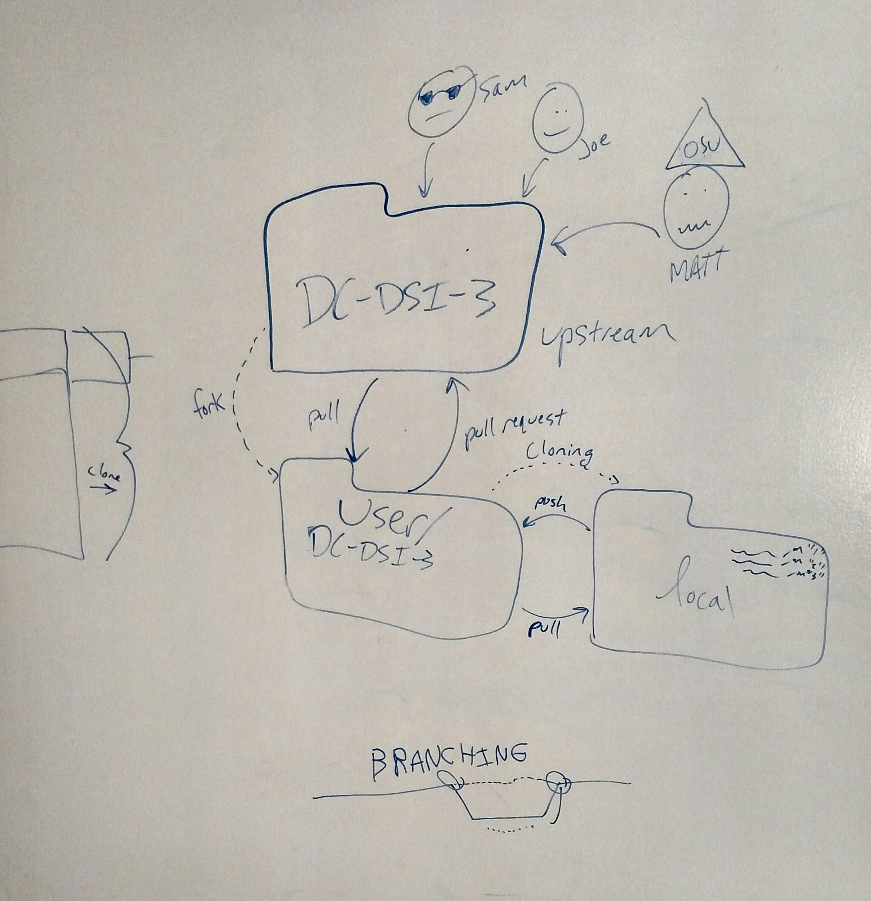

#  Pull Requests

## Advanced Git!



### Pull requests

First, we need to fork the original repository. Visit the original repository, select fork. Add to your own Github. Nice.

Next, let's clone that new fork of the master to our own local machine. To create a local copy, we grab the url and:

```bash
git clone [url of your own fork]
```

We want to be sure that the above command is completed on our local machine in a place that makes sense!

Now, we need to add the initial repository as our upstream repository. cd into the repository we just cloned. Now we can run

```bash
git remote -v
```

to see where our repository pulls from.

We want to pull from the original repository is because we want the changes made to the original repository cloned to our remote repository. To do this, we need to:

```bash
git remote add upstream [original repository url]
```

In the future, we need to:

```bash
git pull upstream master
```

So that we grab the changes from the original repository to our own remote repository.

Side note: git pull: this does both git fetch AND git merge.


Now, we are ready to make a pull request on Github!

Go to our cloned repository. Select "Pull requests" (which probably currently says 0). Be sure that the base fork says YOUR OWN username. Then, select "create pull request" and add a title and comments about your request.

To review:
- Fork the original directory
- Clone that to your local directory
- Edit your remote pulling location to the original/upstream directory
- Work locally, commit your local changes to your remote directory
- Push your changes to your local fork
- Make a pull request (via github.com)


In the future, you will need to be sure to make pull all changes from the upstream master, and add those changes from your local fork to your remote repository. 


## Useful Diagram

[git cheat sheet](http://files.zeroturnaround.com/pdf/zt_git_cheat_sheet.pdf)