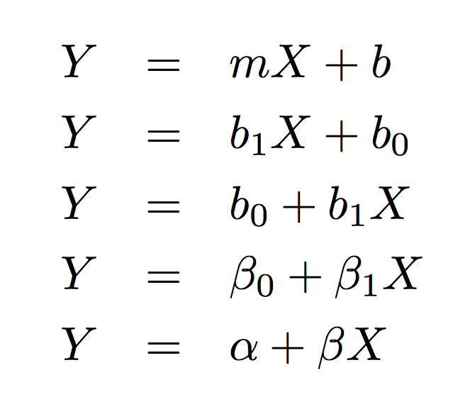
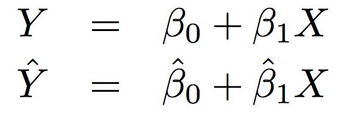
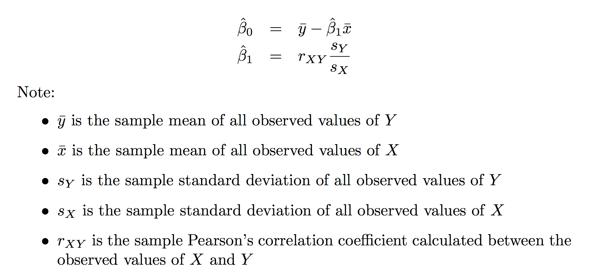
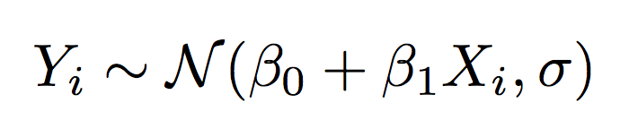

#  Introduction to Linear Regression - Part 1
Week 3 | Lesson 3.01

### LEARNING OBJECTIVES
*After this lesson, you will be able to:*
- Define modeling, inference, prediction, simple linear regression, multiple linear regression, and dummy variable.
- Understand the best fit line of a set of data and potential use cases.
- List the assumptions for a SLR model.
- Fit a simple linear regression line by hand.
- Interpret the slope and Y-intercept and indicate when interpretations are valid.

---

## Introduction

### Modeling

Depending on how long you've lived in a particular place and traveled to a location for work, you probably have a good understanding of commute times in your area. For example, you've traveled to work (or GA!) using some combination of the Metro, buses, trains, Ubers, Lyfts, taxis, carpools, walking, etc.

* All humans naturally model the world around them.

Over time, your observations have built up a mental dataset and a mental model that helps you predict what traffic will be like at various times and locations. You probably use this mental model to help plan your days, predict arrival times, and many other tasks.

* As data scientists we attempt to make our understanding of relationships between different quantities more precise through using data and mathematical/statistical structures.
* This process is called _modeling_.
* Models are simplifications of reality that help us to better understand that which we observe.
* In a data science setting, models generally consist of an independent variable (or output) of interest and one or more dependent variables (or inputs) believed to have an effect on the independent variable.
* Linear regression is an extremely common modeling tool.

### Inference
* We can use a model to conduct inference.
* Given a model, we can better understand relationships between an independent variable and the dependent variable or between multiple independent variables.

**Check:** What are some examples of where inference could be valuable in your work experience?

### Prediction
* We can use a model to make predictions, or to estimate an dependent variable's value given at least one independent variable's value.
* Predictions can be valuable even if they are not exactly right.
* Good predictions are extremely valuable for a wide variety of purposes.

**Check:** What are some examples of where prediction could be valuable in your work experience?

**Check with neighbors:** Which is more important: prediction or inference?

## Linear Regression

### Recap: slope and Y-intercept
You may have previously learned about a linear relationship between some variable X and another variable Y, where you used the phrase "Y equals m X plus b" to describe this relationship.

```
Y = mX + b
```
In this case, we don't know anything (yet!) about the relationship between X and Y. If we decided to plot this on a graph, we wouldn't know where to start because we don't know how X and Y are related. (Another way of saying this is that we don't know m or b.)

This is because a straight line is _parameterized_ by its slope and Y-intercept.

**Recall:** How is the Normal distribution parameterized?

In the equation Y = mX + b, m is the slope. Its value indicates that, if X were to increase by 1 unit, then Y will increase by _exactly_ m units. **(Warning: This is exact if we know that X and Y have exactly a linear relationship. In almost all linear regression applications, this will not be exact!)**

In the equation Y = mX + b, b is the Y-intercept. Its value indicates that, if X equals 0, then Y is _exactly_ equal to b units. **(Warning: This is exact if we know that X and Y have exactly a linear relationship. In almost all linear regression applications, this will not be exact!)**

**Check:** Suppose my commute time to GA includes exactly ten minutes of walking plus exactly three minutes for every Metro stop.
- What is the value of the slope?
- What is the value of the Y-intercept?
- What is the equation of the line?
- Give an example of using this line for prediction.
- Give an example of using this line for inference.

<details><summary> **Answers**
</summary>
- The value of the slope is 3 minutes.
- The value of the Y-intercept is 10 minutes.
- Y = 3X + 10; [commute time in minutes] = 3 * [number of Metro stops] + 10
- If I am five Metro stops away, my commute will be exactly 25 minutes.
- For every Metro stop I am away from GA, my commute will be exactly three minutes longer. (In this example, trivial.)
</details>

This is useful, but we're relying on a whole lot of "exactlys." The relationship between X and Y must be exactly linear. We believe there to be exactly zero measurement error or any other error in our line. 

In addition, this scenario assumed that we knew the true commute times for our model. This is probably not realistic; in most cases we'll gather data and then try to build a model from the data - not the other way around.

Certainly this can't be very applicable in the real world.

### Simple Linear Regression
In simple linear regression (SLR), we take this idea of a linear relationship between X and Y and sidestep many of the issues above.
- We're no longer pulling our slope and Y-intercept from some magical bank of knowledge; we build a simple linear regression _model_ based on our data!
- We no longer need the relationship between X and Y to be _exactly_ linear!
- We understand that errors in our data collection process and in the data itself will exist... and we account for it!

Below are five different ways to represent the same SLR model.


For consistency, moving forward we will use beta_0 for the Y-intercept and beta_1 for the slope.

#### "Best" Values for Slope and Y-Intercept

<details><summary> **Discussion/Demonstration: What is the best value for $$\beta_0$$ and the best value for $beta_1$?**
</summary>
- We need to optimize (maximize or minimize) some criterion.
- The difference between the true value of Y and the predicted value of Y (called Y-hat) is known as a "residual." (For every value of Y-hat_i, there is an accompanying residual e_i.)
- The most common way to define "best fit line" is one that forces the residuals (a.k.a. errors) to be as close to zero as possible.
- This is equivalent to minimizing the [mean squared error](https://en.wikipedia.org/wiki/Mean_squared_error) (MSE) or the [sum of squares of error](https://en.wikipedia.org/wiki/Residual_sum_of_squares) (SSE), also called the "residual sum of squares." (RSS)
</details>

**Recall:** What is the difference between a parameter and a statistic?



Be careful to keep track of this, as these equations mean two different things!

Through some calculus and [ensuing algebra](https://en.wikipedia.org/wiki/Simple_linear_regression#Fitting_the_regression_line), one can show that the estimators for slope and Y-intercept that minimize the MSE are given by:



Note: Estimators are mathematical functions or formulas that yield an estimate. For example, an estimator might be the sample mean whereas the estimate is the value of the sample mean from our data set.

#### Interpretations
The estimators we get from above have really nice properties:
- They are unbiased. (a.k.a. the statistics will on average equal the true parameter value)
- Among all unbiased estimators, the estimators above have the smallest possible variance.
- They are consistent. (a.k.a. as your sample size n goes to infinity, the statistic converges to the true parameter value)

However, these are just mathematical properties. These do not take into account real-world situations. Suppose I want to use a SLR model to predict my commute time and I get the model [commute time] = 8 * [number of Metro stops] - 10. In this case, my commute time is estimated to be negative if I go zero stops or one stop on the Metro. If I were to interpret my Y-intercept, I might say "If I travel zero Metro stops on my way to work, I expect to commute -10 minutes." Of course, this is nonsensical; you can't have a negative commute time!

What this means: When building a model, make sure your model makes sense. You didn't necessarily do something wrong when you fit your model but make a note that there are some shortcomings.

#### Assumptions
Of course, there are _some_ assumptions involved in SLR.
- **Linearity:** Y and X must have an approximately linear relationship.
- **Independence:** Errors (residuals) e_i and e_j must be independent of one another for any i != j.
- **Normality:** The errors (residuals) follow a Normal distribution.
- **Equality of Variances:** The errors (residuals) should have a roughly consistent pattern, regardless of the value of X. (There should be no discernable relationship between X and the residuals.)

The mnemonic **LINE** is a useful way to remember these four assumptions.

Lengthier discussions of the four main assumptions and how one can evaluate or test for each of these can be found [here.](http://people.duke.edu/~rnau/testing.htm)

If all four assumptions are true, the following holds:


### Practice
For this practice, use the following dataset: (-1,0) (1,3) (2,4) (3,7) (4,10).

1. Produce a plot to visualize the relationship between X and Y.

2. Find the values of beta_0 and beta_1 that minimize the residual sum of squares.

3. If time allows, try to produce a second plot of just the residuals. (Hint: e_i = Y_i - Y-hat_i)

#### Final Notes on SLR
The term "linear" here means **linear in the coefficient**. That means that we expect Y to change by a constant amount for a constant change in X. A linear regression model could include X^2, X^3, log(X), etc. **as long as the coefficient is linear!** (This might be a bit confusing, but imagine that instead of squaring X, we created a new column called 'Z' that was equal to X^2.)

You may note that we've assumed that our independent variable X is quantitative. This need not be the case! In many cases, we'll use qualitative variables to explain quantitative outcomes. Some examples:
- One's sex and race are often linked to income.
- The day of the week might explain a bar's profits or the month of the year might affect an airlines' revenues.
- Whether or not someone has children under 5 might help to predict the number of days missed by that employee.

Check out a [worked out example](http://chrisalbon.com/python/pandas_convert_categorical_to_dummies.html) and/or the [Pandas documentation](http://pandas.pydata.org/pandas-docs/version/0.17.0/generated/pandas.get_dummies.html) to see this implemented in Python.

(Practically, dummy variables will apply more for MLR, but it can technically apply to SLR and it's something of which you should be cognizant.)

### Multiple Linear Regression
There are some (almost all!) cases where we might be interested in multiple independent variables. We can generalize our results from an SLR model to include multiple independent variables. We'll follow up on this in our next lecture.

## Conclusion
- Q & A
- Lab

## Resources
- [Linear Regression Assumptions Discussed - Duke University](http://people.duke.edu/~rnau/testing.htm)
- [Wikipedia: Mean Squared Error](https://en.wikipedia.org/wiki/Mean_squared_error)
- [Wikipedia: Residual Sum of Squares](https://en.wikipedia.org/wiki/Residual_sum_of_squares)
