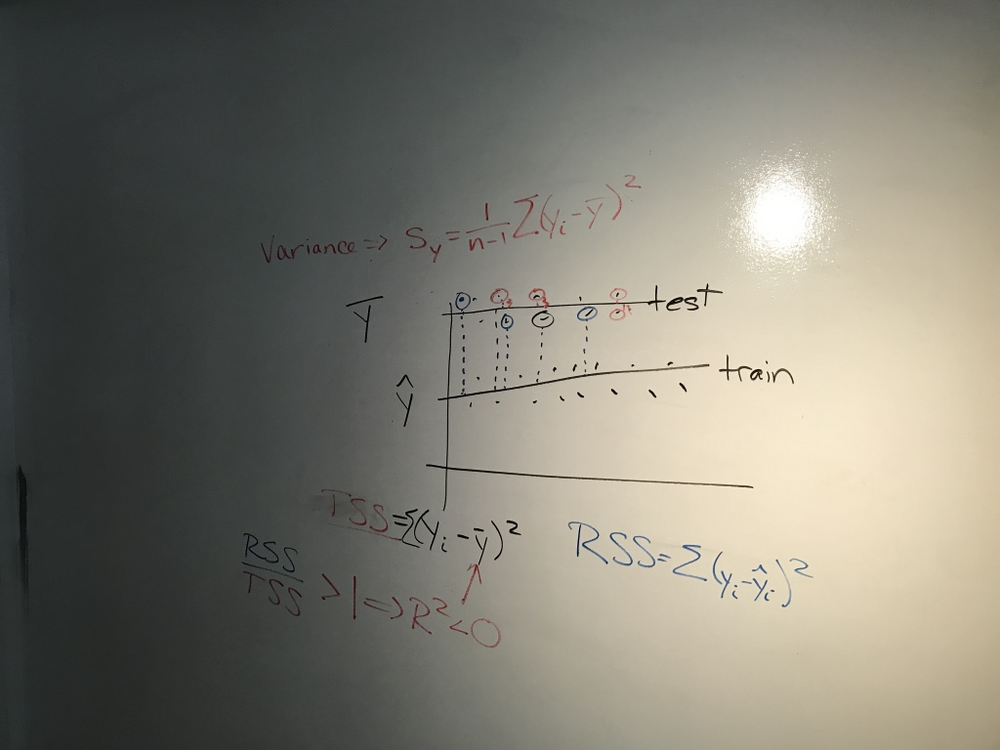

#  Regression Metrics & Gradient Descent
Week 3 | Lesson 3.12

### LEARNING OBJECTIVES
*After this lesson, you will be able to:*
- Define and identify advantages and disadvantages of the following regression metrics: mean squared error, mean absolute error, median absolute error, coefficient of determination, explained variance score, adjusted R^2.
- Implement the gradient descent method.

---

## Introduction
We've learned a lot about linear regression models thus far.
- How to fit linear regression models.
- How to identify potential candidates for independent variables.
- The assumptions of linear regression models and how to assess their validity.
- How to effectively use testing and training sets.
- The role of regularization in regression.

## Regression Metrics
One thing we haven't discussed in significant detail is how to measure the performance of a regression model.

**Turn and Talk:** How might we measure the performance of a model? On which data should we apply this measure?

Luckily, the Scikit-Learn documentation for the most popular regression metrics is robust. It includes just about everything we'll want to know, including potential advantages and disadvantages.

[Scikit-Learn Regression Metrics](http://scikit-learn.org/stable/modules/model_evaluation.html#regression-metrics)

[More General Scikit-Learn Prediction Metrics](http://scikit-learn.org/stable/modules/model_evaluation.html#model-evaluation)

### Comparing R^2 and Adjusted R^2

R^2 is the proportion of variance in the dependent variable Y that is explained by our model...

[Partitioning Total Sum of Squares](https://en.wikipedia.org/wiki/Partition_of_sums_of_squares#Proof)

R^2 is the proportion of variance in the dependent variable Y that is explained by our model **relative to Y-bar**.

When using test and training sets, note that our model (Y-hat) will be constructed on the training set but that the evaluation of our model will be conducted on the test set. In cases where our test and training set are split dependent on some variable of interest (i.e. professor ranking), it is very possible to see adverse effects on our model's performance. This visually explains how splitting test and training sets dependent on a variable of interest can affect Y-bar, Y-hat, and ultimately R^2.

**Check:** What is a potential downside to using R^2 as a metric, and how might we overcome this?

 **Answer**

- In order to overcome the fact that R^2 will not decrease if you include another variable, use adjusted R^2 instead.
- R^2_adj = (MSReg / MST) = 1 - (MSError / MST)
- [Adjusted R-squared Discussion](https://en.wikipedia.org/wiki/Coefficient_of_determination#Adjusted_R2)

## Gradient Descent

### Loss Functions
Loss functions are a class of functions that measure a model's performance.

- All of our regression metrics we've discussed can turn into loss functions! (In the case of metrics where we want to find the maximum, we might refer to these as "utility functions.")

### Optimization
In order to optimize a function analytically, we turn to the [derivative from calculus](https://en.wikipedia.org/wiki/Derivative).
- Remember that the derivative of a function is the slope of the tangent line.
- One application of the derivative in multiple variables is the [gradient](https://en.wikipedia.org/wiki/Gradient), which indicates the direction of the steepest incline (or decline) of a function... perhaps a loss function?
- We'll walk through an example, but the inner workings of calculus won't be super important here. As long as you're comfortable with the intuition behind what we're doing, that'll be sufficient!

### Gradient Descent Algorithm
Goal: To find the best choice of parameter!

- Step 1: Pick a "learning rate," called alpha.
- Step 2: Pick a starting point for your parameter - let's call it beta_1_1.
- Step 3: Check the value of your loss function at beta_1_1 and calculate the gradient.
- Step 4: Replace beta_1_1 with beta_1_2 = beta_1_1 - alpha * gradient of loss function. (Check the picture above to see an example of calculating the gradient for one particular loss function.)
- Step 5: Repeat until you satisfy some condition indicating that you've minimized your loss function (or maximized your utility function).
- Step 6: Take your final value, beta_1_n, and set it equal to your estimate beta_1-hat.

## Conclusion
- Q & A

## Resources
- [Scikit-Learn Regression Metrics](http://scikit-learn.org/stable/modules/model_evaluation.html#regression-metrics)
- [More General Scikit-Learn Prediction Metrics](http://scikit-learn.org/stable/modules/model_evaluation.html#model-evaluation)
- [Partitioning Total Sum of Squares](https://en.wikipedia.org/wiki/Partition_of_sums_of_squares#Proof)
- [Wikipedia: Adjusted R-squared Discussion](https://en.wikipedia.org/wiki/Coefficient_of_determination#Adjusted_R2)
- [Wikipedia: Derivative](https://en.wikipedia.org/wiki/Derivative)
- [Wikipedia: Gradient](https://en.wikipedia.org/wiki/Gradient)
