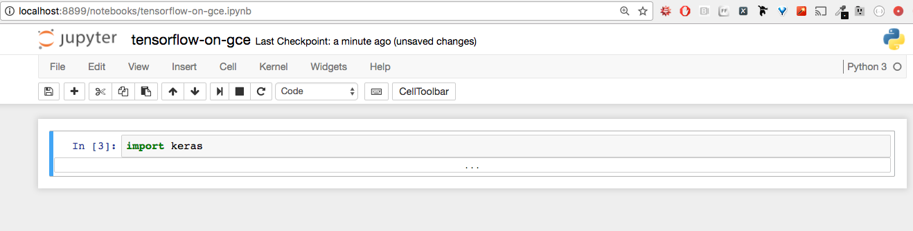

#  Google Cloud Platform GPUs

## Pre-Requisite

This lesson assumes you have already set up your Google Cloud SDK.
- Installing the [SDK](https://cloud.google.com/sdk/docs/#install_the_latest_cloud_tools_version_cloudsdk_current_version)
- Creating a project on GCloud [console](https://console.cloud.google.com)
- Upgrading account out of free tier
- Requesting an increased [quota](https://console.cloud.google.com/compute/quotas)

Verify the increase was approved:

```bash
gcloud beta compute regions describe us-east1
```

## Setting up GPUs on GCP

Before we get started: confirm your gcloud components should be entirely upgraded:

```bash
gcloud components update && gcloud components install beta
```

**Step 1: Confirm your GPU quota and zone**


Not all GCP zones currently support GPU. Also, you may have to request an increase in your GPU limit.
As per https://cloud.google.com/compute/docs/gpus/, currently these zones support GPU — us-west1-b, us-east1-d, europe-west1-b, asia-east1-a.

```bash
$ gcloud beta compute regions describe us-east1
- limit: 1.0
  metric: NVIDIA_K80_GPUS
  usage: 0.0
```

If the limit is <1.0, then please request an increase in the limit at https://console.cloud.google.com/compute/quotas . In my experience, Google has approved the request instantly.


**Step 2: Create GPU enabled instance**

```bash
$ gcloud beta compute instances create gpu-deep-learner --machine-type n1-standard-2 --zone us-east1-d --accelerator type=nvidia-tesla-k80,count=1 --image-family ubuntu-1604-lts --image-project ubuntu-os-cloud --boot-disk-size 50GB --maintenance-policy TERMINATE --restart-on-failure
```

This creates an instance named gpu-deep-learner in us-east1-d zone with 1 GPU and Ubuntu 16.04 (persistent disk size 50GB).

**Step 3: Install CUDA**

First, we need to ssh into the instance (using gcloud). Note that this step will automatically generate an ssh keypair for you!

```bash
$ gcloud compute ssh gpu-deep-learner --zone us-east1-d
```

Install CUDA 8.0 driver and toolkit:

```
~$ curl -O http://developer.download.nvidia.com/compute/cuda/repos/ubuntu1604/x86_64/cuda-repo-ubuntu1604_8.0.61-1_amd64.deb
~$ sudo dpkg -i cuda-repo-ubuntu1604_8.0.61-1_amd64.deb
~$ sudo apt-get update
~$ rm cuda-repo-ubuntu1604_8.0.61-1_amd64.deb
~$ sudo apt-get install cuda -y
```

This step will take awhile. You may hang on the following screen for a bit. That's ok!

 

Confirm:

```bash
~$ nvidia-smi
```

 

Hooray!!!


Set environment variables:

```bash
~$ echo 'export CUDA_HOME=/usr/local/cuda' >> ~/.bashrc
~$ echo 'export PATH=$PATH:$CUDA_HOME/bin' >> ~/.bashrc
~$ echo 'export LD_LIBRARY_PATH=$LD_LIBRARY_PATH:$CUDA_HOME/lib64' >> ~/.bashrc
~$ source ~/.bashrc
```

**Step 4: Install cuDNN**

Register at https://developer.nvidia.com/cudnn and download cuDNN.

You want the linux version:

 

You will also need the external IP address of your running instance. To find that information, login to your [GCP Console](https://console.cloud.google.com). Once there, you should see "Resources" and "1 Instance" under "Compute Engine"
. Click this. You will then see the External IP address in a table.

 

(Note that this IP address is not static. To promote or assign a static IP to your instance, read more [here](https://cloud.google.com/compute/docs/configure-ip-addresses.png).)


Then, FROM YOUR LOCAL MACHINE, scp the file to your new instance. e.g.

```bash
$ scp -i ~/.ssh/google_compute_engine ./Downloads/cudnn-8.0-linux-x64-v6.0.tgz [USERNAME]@<external-IP-of-GPU-instance>:~
```

(NOTE: the above .tgz file name may need to be updated with the exact name of the cuDNN package instance you downloaded.)

(You can find your username on the instance [ssh page](https://console.cloud.google.com/compute/metadata/sshKeys?).)

If this gives you a problem, you may need to generate new ssh keys:
https://cloud.google.com/compute/docs/instances/connecting-to-instance#generatesshkeypair

Now, back on the remote instance, unzip and copy these files:

```bash
~$ cd
~$ tar xzvf cudnn-8.0-linux-x64-v6.0.tgz
~$ sudo cp cuda/lib64/* /usr/local/cuda/lib64/
~$ sudo cp cuda/include/cudnn.h /usr/local/cuda/include/
~$ rm -rf ~/cuda
~$ rm cudnn-8.0-linux-x64-v6.0.tgz
```

At this point, all the NVIDIA/CUDA setup is complete. You can choose your favorite way of installing Python and any deep-learning libraries that use GPU. Anaconda is one popular way to do it.

(NOTE: the above .tgz file name may need to be updated with the exact name of the cuDNN package instance you downloaded.)

**Step 5: Install Anaconda and your favorite deep-learning frameworks**

```bash
~$ curl -O https://repo.continuum.io/archive/Anaconda3-4.3.1-Linux-x86_64.sh
~$ bash Anaconda3-4.3.1-Linux-x86_64.sh
```
(Note that this is for Python 3.6.0!)

Follow the prompts. I also chose “yes” to ‘adding anacoda to your PATH’. (If errors persists, it would be good to exit and log back in.)

 

Use conda or pip to install your library. (pip worked better for TensorFlow):

```bash
~$ pip install tensorflow-gpu
~$ pip install keras
```

**Step 6: Configure Jupyter**

```bash
~$ jupyter notebook --generate-config
Writing default config to: /home/USER/.jupyter/jupyter_notebook_config.py
```

Edit /home/USER/.jupyter/jupyter_notebook_config.py to include the following at the top:

```python
c = get_config()  # get the config object
c.IPKernelApp.pylab = 'inline'  # in-line figure when using Matplotlib
c.NotebookApp.open_browser = False  # do not open a browser window by default when using notebooks
c.NotebookApp.token = '' # No token. But, please, please always use jupyter over ssh tunnel
```

**Step 7: SSH tunnel forwarding**

Set up a tunnel from your local machine to access Jupyter over ssh.

```bash
~ ssh -i .ssh/ubuntu_gcp -L 8899:localhost:8888 [USER]@<IP-address-of-your-GPU-instance>
```

Then, on the server, start Jupyter.

```bash
~$ mkdir notebooks
~$ cd notebooks
~/notebooks$ jupyter notebook
```

**Step 8: Start using Jupyter on local browser**

Navigate to http://localhost:8899/ and create a new notebook. Verify by importing keras or tensorflow. The remote log will also confirm whether you are using the GPU/Cuda libraries.

 

Once you are done, please remember to stop your instance to save costs. These GPU instances are not cheap. Enjoy.

Visit the [instances page](https://console.cloud.google.com/compute/instances) to manage running machines.

Notes:

conda install pytorch torchvision -c soumith will get you set up with PyTorch.
pip install keras also installed Theano 0.9. However, this version of Theano may give a deprecation warning about moving to the new gpuarray backend. You can install libgpuarray to fix this.